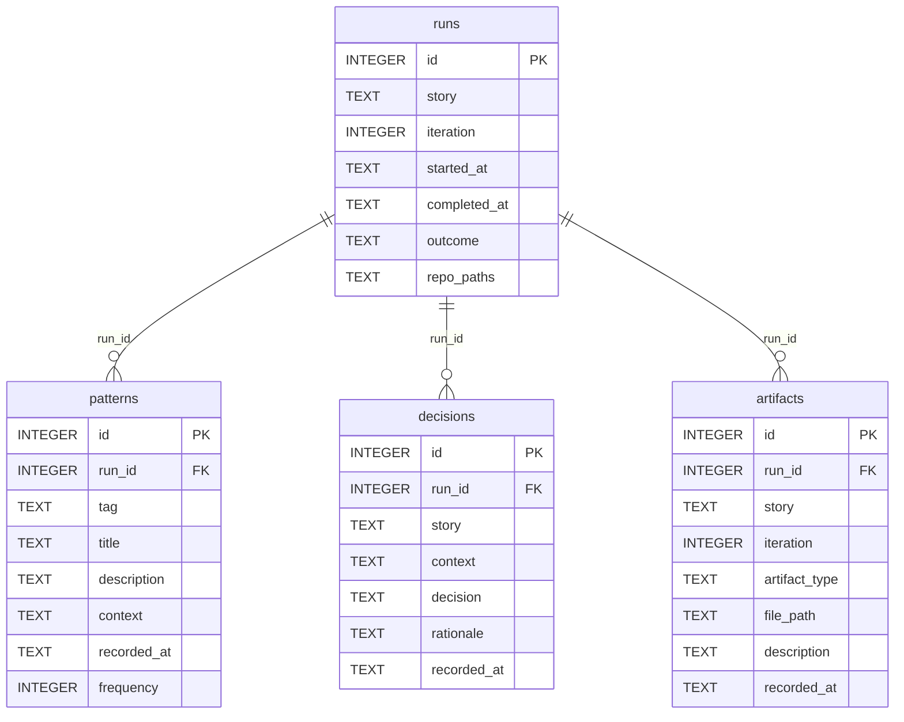

# Knowledge Data Model

`runs` is the top-level container — one per story iteration. `patterns.frequency`
is the only column that mutates after insert: it increments when the same
`tag + title` combination is re-recorded across runs.
