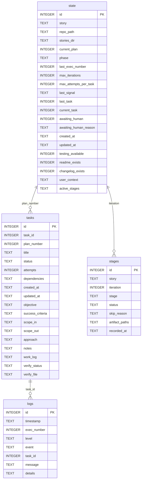

# Story Data Model

`story.db` holds four tables across two schema files: `story/schema.py`
(state, tasks, stages) and `logger/schema.py` (logs).

`state` is a singleton row (`id = 1`). `tasks` has a composite unique key on
`(task_id, plan_number)` — the same logical task can exist across multiple plans.
`logs.task_id` is nullable; log entries not tied to a specific task omit it.
`dependencies` in `tasks` is stored as a JSON array of `task_id` integers.
