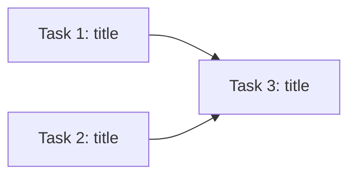

# Planning: Generate, Revise, or Approve a Plan

Entry point for ALL `.begin` invocations. Run `plot begin` first to detect the mode, then follow the appropriate path below.

---

## Step 1: Read Configuration

**Before proceeding, read and follow:** `plot/agent-rules.md`

Key variables: `{plot}`, `{python}`, `{stories_dir}`, `{workspace}`

## Step 2: Run `plot begin`

**Repo shorthand**: Bare folder names resolve under `{workspace}` (e.g. `api_framework` → `{workspace}/api_framework`). Multiple repos can be comma-separated: `"api_framework, other-repo"`. Quote the repo arg if it contains commas or spaces.

```bash
{plot} begin {story} "{repo_path}" --user-context="{user_context}"
```

Or for existing stories (revision/approval):

```bash
{plot} begin {story} --user-context="{user_context}"
```

Read the MODE from the output and follow the corresponding section below.

---

## MODE: new / new_plan -- Generate Plan (Mode A)

A new story (or new plan for an existing story) has been initialized. Your job is to produce a reviewable `plan.md` document.

### Step A1: Clarification Phase

Analyze the request for ambiguities before writing anything:

1. **If clarification is needed** (design decisions affect task structure, scope is ambiguous, technical approach is unspecified, dependencies unclear):
   - Output `CLARIFICATION_NEEDED:` followed by numbered questions (max 10)
   - STOP and wait for user response
   - After answers, incorporate into context and continue

2. **If the plan is clear**: Continue immediately

### Step A2: Explore the Codebase

Before writing the plan, understand the codebase:

1. Read key files referenced in the request or user_context
2. Understand existing patterns, conventions, and architecture
3. Identify integration points and constraints
4. Note anything that affects task decomposition
5. Run `{plot} skills` — if `mermaid-diagrams` is listed, use mermaid for all diagrams in the plan

### Step A3: Evaluate Addons

Read `templates/evaluate-addons.md` and evaluate its addon registry against what you know from Steps A1–A2. Note which addons are active — their templates will be read in Step A4.

### Step A4: Generate `plan.md`

If any addons were identified in Step A3, read their template files now and follow their **Instructions** for which sections to add and where they go in the plan structure below.

Create `{stories_dir}/{story}/story{n}/plan/plan.md` with this format:

```markdown
# Plan: {story-name}

> **Status**: draft
> **Repository**: {repo_path}  <!-- comma-separated if multi-repo -->
> **Created**: {timestamp}
> **Revision**: 1
> **Addons**: {comma-separated addon names, or "none"}

## Summary

{2-4 paragraph overview: what, how, why, trade-offs}

## Stage Tracking

Which of the 7 pipeline stages are in scope for this story.
Planner fills this in; executor calls `plot skip-stage` for each skipped row.

| Stage | Status | Artifacts | Skip Reason |
|-------|--------|-----------|-------------|
| goal | in-scope / skipped | {e.g. plan.md} | — |
| requirements | in-scope / skipped | {e.g. plan.md §Requirements} | — |
| architecture | in-scope / skipped | {e.g. plan.md §Architecture} | — |
| task_breakdown | in-scope / skipped | {e.g. plan.md §Task Breakdown} | — |
| implementation | in-scope / skipped | {task work logs} | — |
| verification | in-scope / skipped | {verify/ artifacts} | — |
| integration | in-scope / skipped | {e.g. summary.md} | — |

## Codebase Context

{Findings from exploration: patterns, key files, constraints, integration points}

<!-- ADDON SECTIONS: Insert sections from active addons here, before Task Breakdown.
     Each addon template specifies the section structure to include. -->

## Task Breakdown

### Task 1: {title}

**Objective:** {Clear, specific statement}

**Dependencies:** None

**Scope:**
- **In:** {specific files, functions, areas}
- **Out:** {boundaries}

**Success Criteria:**
1. {specific, verifiable}
2. {specific, verifiable}

**Approach:**
1. {concrete step}
2. {concrete step}

---

(repeat for all tasks)

## Dependency Graph

{Mermaid diagram of task dependencies — use mermaid-diagrams skill if available}



## Assumptions

- {assumption}

## Risks and Considerations

- {risk and mitigation}

## Open Questions

- {uncertainty} (remove section if none)

## Revision History

- **Rev 1 (draft)**: Initial plan generated from requirements
```

**Task Decomposition Guidelines:**

- Each task completable in a single agent session
- Clear, verifiable success criteria
- No separate testing tasks (testing happens at finalization)
- Split by stage, not by item, when applying patterns to multiple entities

### Step A5: Register Stage Skips

For every stage marked `skipped` in the Stage Tracking table, run:

```bash
{plot} skip-stage {story} {stage} -m "{skip reason from Stage Tracking table}"
```

Do this for each skipped stage before generating the pre-design.

### Step A6: Generate `pre-design.md`

Read `templates/pre-design.md` for the format. Distill `plan.md` into the pre-design structure. Write to `{stories_dir}/{story}/story{n}/plan/pre-design.md`.

### Step A7: Log and Signal

```bash
{plot} log {story} PLAN_DRAFT --task=0 -m "Draft plan created with {n} tasks"
```

Output:

```
PLAN_DRAFT: {n} tasks proposed in plan.md
- Plan file: {stories_dir}/{story}/story{n}/plan/plan.md
- Pre-design: {stories_dir}/{story}/story{n}/plan/pre-design.md
- Review the plan and either:
  - Edit plan.md directly in your IDE
  - Use `.begin {story} --user-context="<feedback>"` to request revisions
  - Use `.begin {story} --user-context="approved"` to approve and create tasks
```

**STOP** — Wait for human review.

---

## MODE: revise -- Revise Plan (Mode B)

The story is in `planning` phase and the user has provided feedback.

### Step B1: Read Current Plan

Read `{stories_dir}/{story}/story{n}/plan/plan.md`

### Step B2: Apply Revisions

1. Analyze the requested changes (from user_context or inline feedback)
2. Re-explore the codebase if the changes affect technical decisions
3. Re-evaluate addon criteria from Step A3 — addons may become applicable or inapplicable after revision
4. Update `plan.md`:
   - Increment revision number
   - Apply modifications
   - Update the **Addons** metadata field if addon applicability changed
   - Add or remove addon sections as needed
   - Update Stage Tracking table if scope changes affect which stages apply
   - Add entry to Revision History
5. Re-run `plot skip-stage` for any newly added skips; existing skip registrations remain valid
6. Regenerate `pre-design.md` following Step A6

### Step B3: Log and Signal

```bash
{plot} log {story} PLAN_REVISION --task=0 -m "Rev {n}: {summary of changes}"
```

Output:

```
PLAN_REVISED: Updated plan.md and pre-design.md (revision {n})
- Changes: {brief summary}
- Review the updated plan and provide further feedback or approve
```

**STOP** — Wait for next review cycle.

---

## MODE: approve -- Create Tasks from Approved Plan

The plan has been approved. Read and follow `templates/task-creation.md` to create tasks.

---

## CLI Reference

```bash
{plot} begin <story> ["repo[,repo...]"] [--user-context=...] [--json]
{plot} state <story> [--json]
{plot} log <story> <EVENT> [--task=ID] [-m MSG]
{plot} skip-stage <story> <stage> -m "<reason>"
```
